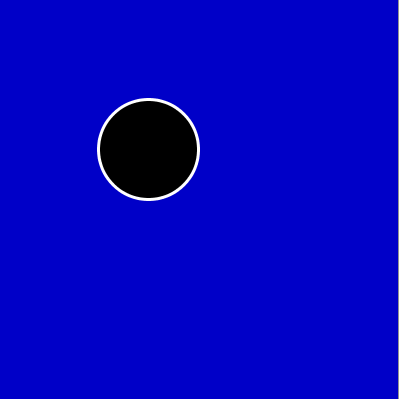
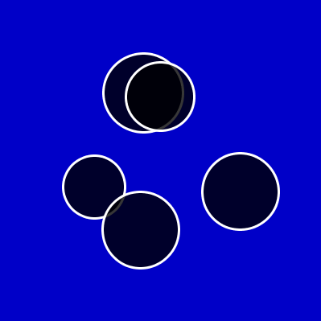

# Arrastando círculos



neste exemplo vamos usar três funções que o processing dispara pra nós em eventos do mouse(`mouse_pressed()`, `mouse_released()` e `mouse_dragged()`) para criar um elemento de interação interessante, um círculo que possa ser arrastado.

A ideia é que você possa adaptar este código para, por exemplo, arrastar pontos de controle de uma curva/polígono, ou então, outros 'elementos gráficos' do seu * sketch*.

# Arrastando um círculo

0. vamos precisar de um indicador de estado(*flag*) parara saber se o arraste começou, para isso vamos usar a variável global `arrastando`, e vamos precisar também duas variáveis para a posição do círculo, `x_circulo` e `y_circulo`.

1. dentro de `mouse_pressed()` vamos checar se o mouse está sobre o círculo. A estratégia escolhida foi usar a função `dist()` para comparar a distância do mouse até o centro do círculo com o raio do círculo(se a distância for menor que o raio, o mouse está sobre o círculo). esse tipo de checagem é conhecida em programação de jogos e interfaces como "checagem de colisão".

neste caso estamos fazendo uma checagem de colisão ponto-círculo(a posição do mouse é o ponto), e para outros casos, outros elementos gráficos, é preciso encontrar a estratégia apropriada. veja, por exemplo, o código do[botão simples](botao_simples.md) para ver como é a checagem de colisão ponto-retângulo.

caso o mouse esteja dentro do círculo quando for apertado, mudamos `arrastando` de `False` para `True`.

2. dentro de `mouse_released()` vamos só mudar `arrastando` para `False`. isto significa que quando um botão do mouse for solto acabou qualquer arraste que por ventura estivesse em andamento. se não havia círculo sendo arrastado, nada muda.

3. dentro de `mouse_dragged()`, executado quando o mouse é movido apertado, isto é, em 'arraste' (*drag*), se o indicador `arrastando` for `True`, indicando que o círculo estava sob o mouse, vamos atualizar as variáveis globais `x_circulo` e `y_circulo` com o deslocamento do mouse. O deslocamento é obtido pela diferença da posição atual do mouse, `mouse_x` e `mouse_y`, para a posição imediatamente anterior(*previous*) que temos com`pmouse_x` e `pmouse_y`.

```python
arrastando = False
x_circulo, y_circulo = 150, 150
D_CIRCULO = 100  # diâmetro do círculo


def setup():
    size(400, 400)
    stroke_weight(3)
    fill(0)


def draw():
    background(0, 0, 200)
    if arrastando:
        stroke(200, 0, 0)
    else:
        stroke(255)
    ellipse(x_circulo, y_circulo, D_CIRCULO, D_CIRCULO)


def mouse_pressed():  # quando um botão do mouse é apertado
    global arrastando
    dist_mouse_circulo = dist(mouse_x, mouse_y, x_circulo, y_circulo)
    raio = D_CIRCULO / 2
    if dist_mouse_circulo < raio:
        arrastando = True


def mouse_released():  # quando um botão do mouse é solto
    global arrastando
    arrastando = False


def mouse_dragged():  # quando o mouse é movido apertado
    global x_circulo, y_circulo
    if arrastando:
        # mouseX - pmouseX é o que o mouse foi arrastado em X
        x_circulo += mouse_x - pmouse_x
        # mouseY - pmouseY é o que o mouse foi arrastado em Y
        y_circulo += mouse_y - pmouse_y


```

# Arrastando vários círculos




para acompanhar o próximo exemplo você precisa estar familiarizado com[sequências e laços de repetição](lacos_py.md), uma vez que vamos usar uma estrutura de dados, uma lista, com tuplas dentro, para manter a posição e tamanho de vários círculos, permitindo que qualquer um deles seja arrastado!. um dos elementos sofisticados deste exemplo é que pegamos para olhar os dados de um círculo por vez, mas ao mesmo tempo, graças à função `enumerate()` recebemos a informação do índice, da posição desses dados na lista `circulos`. usamos esse índice para indicar qual círculo está sendo arrastado.

0. A variável global `arrastando`  vai manter registro da situação de arraste, como no exemplo anterior, só que agora também indicando o índice de posição de um círculo na lista `circulos`. vamos estabelecer que `None` significa que nenhum círculo está sendo arrastado(um papel feito por `False` no exemplo anterior).

1. na função `mouse_pressed()` vamos checar uma a uma cada tupla da lista, contendo X, Y e diâmetro dos círculos, e caso algum deles esteja sob o mouse, vamos atualizar a variável `arrastando` apontando o índice dessa tupla na lista. O primeiro círculo encontrado interrompe a busca, só um círculo pode ser arrastado por vez. no caso de vários círculos estarem sob o mouse, é selecionado o que vier antes na lista, por conta disso, é selecionado aquele que é desenhado primeiro, o 'mais de baixo' entre eles.

2. A função `mouse_released()` altera `arrastando` para `None`. nenhum círculo está sendo arrastado.

3. A função `mouse_dragged()`, caso `arrastando` não seja `None`, é criada uma nova tupla com a posição atualizada do círculo e é alterada a lista na posição indicada por `arrastando`.

```python
arrastando = None  # None quer dizer nenhum círculo sendo arrastado
circulos = []  # lista com coordenadas e tamanhos dos círculos


def setup():
    size(400, 400)
    stroke_weight(3)
    fill(0, 200)  # preenchimento translúcido
    for _ in range(5):  # vamos sortear 5 círculos
        d = random(30, 100)
        x = random(d, width - d)
        y = random(d, height - d)
        circulos.append((x, y, d))


def draw():
    background(0, 0, 200)
    for i, circulo in enumerate(circulos):
        x, y, d = circulo
        if i == arrastando:
            stroke(200, 0, 0)
        else:
            stroke(255)
        ellipse(x, y, d, d)


def mouse_pressed():  # quando um botão do mouse é apertado
    global arrastando
    # vamos olhar um círculo por vez da lista `circulos`
    for i, circulo in enumerate(circulos):  # i é o índice na lista
        x, y, d = circulo
        dist_mouse_circulo = dist(mouse_x, mouse_y, x, y)
        raio = d / 2
        if dist_mouse_circulo < raio:  # se o mouse estiver dentro
            arrastando = i
            break  # interrompe o laço, não checa mais outros!


def mouse_released():  # quando um botão do mouse é solto
    global arrastando
    arrastando = None


def mouse_dragged():  # quando o mouse é movido apertado
    if arrastando is not None:
        x, y, d = circulos[arrastando]
        x += mouse_x - pmouse_x
        y += mouse_y - pmouse_y
        circulos[arrastando] = (x, y, d)


```
# Desafio

note que quando os círculos se sobrepõe, o clique do mouse "captura" o mais de baixo para o arraste. você conseguiria mudar este comportamento?
dica:  é possível usar `reversed()` para inverter uma lista, mas o problema é que `enumerate()` não nos entrega uma lista... é possível converter o "objeto enumerador" entregue por `enumerate()` em uma lista com `list()`.


# Assuntos relacionados

- [um botão simples](botao_simples.md)
- [sequências e laços de repetição](lacos_py.md)
