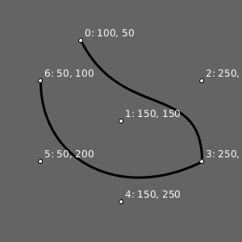
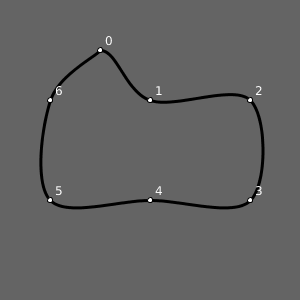
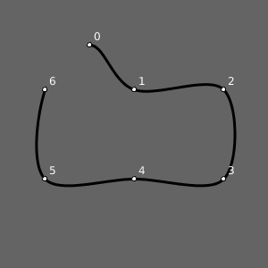
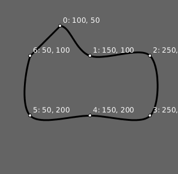

# Desenhando curvas - I

Agora que já sabemos[desenhar um polígonos com `begin_shape()` e `end_shape()` ou `end_shape(CLOSE)`](poligonos_2.md) podemos experimentar formas curvas.

# Sumário

[Curvas Bezier com `bezier_vertex()`](  # curvas-bezier-com-beziervertex)

[Curvas com `curve_vertex()`](  # curvas-com-curvevertex)
- [Exemplo 1: Comportamento inesperado](  # exemplo-1-comportamento-inesperado)
- [Exemplo 2: Fechando a curva corretamente](  # exemplo-2-fechando-a-curva-corretamente)
- [Exemplo 3: Curva aberta](  # exemplo-3-curva-aberta)
- [Exemplo 4: Curva aberta usando diferentes pontos](  # exemplo-4-curva-aberta-usando-diferentes-pontos)
- [Exemplo 5: Usando `end_shape(CLOSE)`](  # exemplo-5-usando-endshapeclose)

[Simulando arcos e filetes com Bezier](  # simulando-arcos-e-filetes-com-bezier)

[Assuntos relacionados](  # assuntos-relacionados)

[Extra: Um testador de curvas interativo](  # extra-um-testador-de-curvas-interativo)

# Curvas Bezier com `bezierVertex()`

As famosas curvas Bezier levam o nome de Pierre Bézier, que as desenvolveu em seus trabalhos na década de 1960 na indústria automotiva, elas descrevem curvas a partir das coordenadas de pontos, ou âncoras, que delimitam o início e o fim de uma curva, mas também precisam de "pontos de controle" que em geral ficam fora da curva, mas controlam o seu comportamento.

Você pode usar um ou mais vértices * Bezier * entre o `begin_shape()` e o `end_shape()`, e ela pode ser aberta ou fechada(com `end_shape(CLOSE)`), mas antes de cada `bezier_vertex()` é preciso que haja algum outro vértice, um ponto âncora, que marca o início e que pode ser feito com `vertex()`, como neste exemplo a seguir.

No `bezier_vertex()` propriamente dito, os quatro primeiros argumentos são as cordenadas de dois pontos de controle e os últimos dois são as coordenadas do vértice(que pode servir de âncora inicial para um próximo vértice Bezier).

```
 begin_shape()
    vertex(100, 50)         # 0: âncora inicial
    bezier_vertex(150, 150,  # 1: primeiro ponto de controle do primeiro vértice
                 250, 100,  # 2: segundo ponto de controle do primeiro vértice
                 250, 200),  # 3: vértice final da primeira curva, âncora da segunda
    bezier_vertex(150, 250,  # 4: primeiro ponto de controle do segundo vértice
                 50, 200,   # 5: segundo ponto de controle do segundo vértice
                 50, 100)   # 6: segundo vértice bezier (final)
    end_shape(),
```



< details >
< summary > Código completo para reproduzir a imagem acima < /summary >
< pre >

def setup():
    size(300, 300)

def draw():
    background(100)
    stroke_weight(3)
    stroke(0)
    no_fill()

    begin_shape()
    vertex(100, 50)
    bezier_vertex(150, 150,
                    250, 100,
                    250, 200),
    bezier_vertex(150, 250,
                    50, 200,
                    50, 100)
    end_shape()


    pontos=[
        (100, 50),
        (150, 150),
        (250, 100),
        (250, 200),
        (150, 250),
        (50, 200),
        (50, 100),
        ]
    stroke_weight(1)
    for i, ponto in enumerate(pontos):
        x, y=ponto
        fill(255)
        ellipse(x, y, 5, 5)
        t="{}: {:3}, {:3}".format(i, x, y)
        text(t, x+5, y-5)

< /pre >
< / details >

# Curvas com `curveVertex()`

Agora que já sabemos iterar por uma estrutura de dados, e como usar as coordenadas das tuplas para desenhar um polígono, podemos experimentar a mesma estratégia com outros tipos de vértice.

Vejamos agora o `curve_vertex()`, uma forma de descrever curvas que não tem os pontos de controle como as Bezier, mas tem a curiosa propriedade dos pontos/vértices serem influenciados pelos pontos que vem antes e depois deles.

Vamos iterar por uma estrutura de dados, e usar as coordenadas de tuplas, da mesma forma que fizemos para desenhar um polígono, só que desta vez vamos experimentar essa estratégia com outros tipos de vértice, os vértices de curva, que acabamos de mencionar. Considere esta lista de pontos:


```python
pontos=[
    (100, 50),
    (150, 100),
    (250, 100),
    (250, 200),
    (150, 200),
    (50, 200),
    (50, 100),
    ]
```

# Exemplo 1: Comportamento inesperado

Se chamarmos uma vez `curve_vertex()` para cada vértice dentro de um contexto de `begin_shape()` e `end_shape(CLOSE)`obteremos o seguinte resultado, esquisito(estou aqui omitindo parte do código que controla os atributos gráficos e mostra os texto com os índices dos pontos):

```python
begin_shape()
for x, y in pontos:
    curve_vertex(x, y)
end_shape(CLOSE)
```


< details >
< summary > Código completo para reproduzir a imagem acima < /summary >

 < pre >
 pontos=[
    (100, 50),
    (150, 100),
    (250, 100),
    (250, 200),
    (150, 200),
    (50, 200),
    (50, 100),
    ]

def setup():
    size(300, 300)

def draw():
    background(100)
    stroke_weight(3)
    stroke(0)
    no_fill()

    begin_shape()
    for x, y in pontos:
        curve_vertex(x, y)
    end_shape(CLOSE)
    stroke_weight(1)
    for i, ponto in enumerate(pontos):
        x, y=ponto
        fill(255)
        ellipse(x, y, 5, 5)
        text(i, x+5, y-5)
< /pre >
< / details >

# Exemplo 2: Fechando a curva corretamente

Para obter o resultado esperado(ou, caro leitor, pelo menos o que eu esperava) temos que acrescentar uma chamada com as coordenadas do último vértice antes do primeiro, e do primeiro e segundo vértices depois do último! Diga lá se não é estranho isso!

```python
curve_vertex(pontos[-1][0], pontos[-1][1])
for x, y in pontos:
    curve_vertex(x, y)
curve_vertex(pontos[0][0], pontos[0][1])
curve_vertex(pontos[1][0], pontos[1][1])
end_shape(CLOSE)
```



< details >
< summary > Código completo para reproduzir a imagem acima < /summary >

 < pre >
pontos=[
    (100, 50),
    (150, 100),
    (250, 100),
    (250, 200),
    (150, 200),
    (50, 200),
    (50, 100),
    ]

def setup():
    size(300, 300)

def draw():
    background(100)
    stroke_weight(3)
    stroke(0)
    no_fill()

    begin_shape()
    curve_vertex(pontos[-1][0], pontos[-1][1])
    for x, y in pontos:
        curve_vertex(x, y)
    curve_vertex(pontos[0][0], pontos[0][1])
    curve_vertex(pontos[1][0], pontos[1][1])
    end_shape(CLOSE)
    stroke_weight(1)
    for i, ponto in enumerate(pontos):
        x, y=ponto
        fill(255)
        ellipse(x, y, 5, 5)
        text(i, x + 5, y - 5)

< /pre >
< / details >

# Exemplo 3: Curva aberta

É possível fazer uma curva aberta com os mesmo pontos e a mesma influência do último ponto no primeiro, e do primeiro no último, omitindo o `CLOSE`:

```python
curve_vertex(pontos[-1][0], pontos[-1][1])
for x, y in pontos:
    curve_vertex(x, y)
curve_vertex(pontos[0][0], pontos[0][1])
end_shape()
```



< details >
< summary > Código completo para reproduzir a imagem acima < /summary >
< pre >
pontos=[
    (100, 50),
    (150, 100),
    (250, 100),
    (250, 200),
    (150, 200),
    (50, 200),
    (50, 100),
    ]

def setup():
    size(600, 600)

def draw():
    background(100)
    stroke_weight(3)
    stroke(0)
    no_fill()

    begin_shape()
    curve_vertex(pontos[-1][0], pontos[-1][1])
    for x, y in pontos:
        curve_vertex(x, y)
    curve_vertex(pontos[0][0], pontos[0][1])
    curve_vertex(pontos[1][0], pontos[1][1])
    pontos=[
    (100, 50),
    (150, 100),
    (250, 100),
    (250, 200),
    (150, 200),
    (50, 200),
    (50, 100),
    ]


< /pre >
< / details >


# Exemplo 4: Curva aberta usando diferentes pontos

Agora se não queremos essa influência da curva fechada, é preciso repetir o primeiro e o último vértice.

```python
begin_shape()
curve_vertex(pontos[0][0], pontos[0][1])
for x, y in pontos:
    curve_vertex(x, y)
curve_vertex(pontos[-1][0], pontos[-1][1])
end_shape()
```


< details >
< summary > Código completo para reproduzir a imagem acima < /summary >
< pre >
pontos=[
    (100, 50),
    (150, 100),
    (250, 100),
    (250, 200),
    (150, 200),
    (50, 200),
    (50, 100),
    ]

def setup():
    size(600, 600)

def draw():
    background(100)
    stroke_weight(3)
    stroke(0)
    no_fill()

    begin_shape()
    curve_vertex(pontos[0][0], pontos[0][1])
    for x, y in pontos:
        curve_vertex(x, y)
    curve_vertex(pontos[-1][0], pontos[-1][1])
    end_shape()
    stroke_weight(1)
    for i, ponto in enumerate(pontos):
        x, y=ponto
        fill(255)
        ellipse(x, y, 5, 5)
        text(i, x+5, y-5)
< /pre >
< / details >


# Exemplo 5: Usando `endShape(CLOSE)`

Veja como ficaria acrescentando-se o `CLOSE` em `end_shape(CLOSE)`


< details >
< summary > Código completo para reproduzir a imagem acima < /summary >
< pre >
pontos=[
    (100, 50),
    (150, 100),
    (250, 100),
    (250, 200),
    (150, 200),
    (50, 200),
    (50, 100),
    ]

def setup():
    size(600, 600)

def draw():
    background(100)
    stroke_weight(3)
    stroke(0)
    no_fill()

    begin_shape()
    curve_vertex(pontos[0][0], pontos[0][1])
    for x, y in pontos:
        curve_vertex(x, y)
    curve_vertex(pontos[-1][0], pontos[-1][1])
    end_shape(CLOSE)
    stroke_weight(1)
    for i, ponto in enumerate(pontos):
        x, y=ponto
        fill(255)
        ellipse(x, y, 5, 5)
        text(i, x+5, y-5)
< /pre >
< / details >

# Assuntos relacionados

- [Desenhando Polígonos - I](poligonos_1.md)
- [Desenhando Polígonos - II](poligonos_2.md)
- [Sequências e laços de repetição](lacos_py.md)

# EXTRA: Um testador de curvas interativo

** Desafio: ** Você conseguiria escrever o código que permite testar as curvas arrastando os pontos com o mouse?



< details >

< summary > Resposta: Usando a mesma estratégia de "arrastar círculos". < /summary >

< pre >
  arrastando=None

  pontos=[
      (100, 50),
      (150, 100),
      (250, 100),
      (250, 200),
      (150, 200),
      (50, 200),
      (50, 100)]

  def setup():
      size(300, 300)

  def draw():
      background(100)
      stroke_weight(3)
      stroke(0)
      no_fill()

      begin_shape()
      global pontos
      global arrastando
      curve_vertex(pontos[-1][0], pontos[-1][1])
      for x, y in pontos:
          curve_vertex(x, y)
      curve_vertex(pontos[0][0], pontos[0][1])
      end_shape(CLOSE)
      stroke_weight(1)
      for i, ponto in enumerate(pontos):
          x, y=ponto
          if i == arrastando:
              fill(200, 0, 0)
          else:
              fill(255)
          ellipse(x, y, 5, 5)
          t="{}: {:03}, {:03}".format(i, x, y)
          text(t, x + 5, y - 5)

  def mouse_pressed():            # quando um botão do mouse é apertado
      global arrastando
      for i, ponto in enumerate(pontos):
          x, y=ponto
          dist_mouse_ponto=dist(mouse_x, mouse_y, x, y)
          if dist_mouse_ponto < 10:
              arrastando=i
              break  # encerra o laço

  def mouse_released():
      # quando um botão do mouse é solto
      global arrastando
      arrastando=None

  def mouse_dragged():
       # quando o mouse é movido apertado
       global pontos
       global arrastando
       if arrastando is not None:
          x, y=pontos[arrastando]
          x += mouse_x - pmouse_x
          y += mouse_y - pmouse_y
          pontos[arrastando]=(x, y)
< /pre >

< / details >
