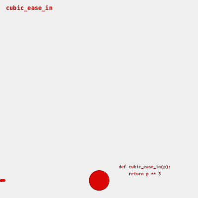
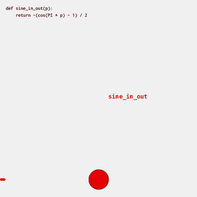

# O que é *easing*?

A ideia por trás de * easing * é a suavização de transições de um movimento, uma vez que, na natureza, os movimento tem variação de velocidade que raramente são instantâneas ou lineares.

Um movimento pode iniciar rapidamente  e parar suavemente(*easing out*), iniciar suavemente(*ease in *) ou ainda iniciar e parar suavemente(*easing in and out*).

# Funções para suavização das transições

Para o conteúdo a seguir vamos precisar[manipular faixas de valores com `map()` e `lerp()`](map_lerp.md)

Uma estratégia muito comum é  usar funções de * easing * que recebem um valor entre ** 0 ** e ** 1 ** e retornam um valor, grosso modo na mesma faixa, o pelo menos nos extremos(eventualmente passado um pouco para fora). Os valores podem ser usados em conjunto com `lerp()` ou simplesmente multiplicando um outro valor.

Em uma função `easing(p)` um `p = 0` devolve ** 0 ** e `p = 1` produz ** 1**, mas a variação intermediária acontece em velocidades diferentes. O * não-easing * é o crescimento linear, em que o valor devolvido é exatamente o mesmo recebido pela função.

Vejamos um exemplo que fizemos inicialmente na explicação do `map()` de um círculo que anda e vai de preto para branco, mas agora usando `lerp()` e uma função de * easing * exponencial 'sigmóide', na saída e na chegada(* in * e * out*).

```python


def setup():
    size(400, 400)
    stroke_weight(3)


def draw():
    background(200)

    # O map original
    #   cinza = map(mouseX, 0, width, 0, 255)
    #   x = map(mouseX, 0, width, 100, 300)
    # Pode ser expresso em forma de t para usar lerp()
    t = map(mouse_x, 0, width, 0, 1)
    cinza = lerp(0, 255, t)
    x = lerp(100, 300, t)
    fill(cinza)
    circle(x, height * .33, 100)

    # Aplicando 'easing' em 't'
    e = sigmoid_easing(t)
    e_cinza = lerp(0, 255, e)  # ou 255 * e
    e_x = lerp(100, 300, e)  # ou 100 + 200 * e
    fill(e_cinza)
    circle(e_x, height * .66, 100)


def sigmoid_easing(p):
    """ from John @introscopia """
    const = 6
    m = lerp(-const, const, p)
    return 1 / (1 + exp(-m))


#  # John fez também um map com o easing embutido
#  def sigmoidMap(value, start1, stop1, start2, stop2, const=6):
#  """ from John @introscopia """
#      m = map(value, start1, stop1, -const, const)
#      return ((stop2 - start2) * (1 / (1 + exp(-m)))) + start2
```


# Outros exemplos



```python


def cubic_ease_in(p):
    return p ** 3


def quadratic_ease_in(p):
    return p ** 2


def linear(p):
    # sem easing, para comparação
    return p


def quadratic_ease_out(p):
    return -(p * (p - 2))


def cubic_ease_out(p):
    f = (p - 1)
    return f ** 3 + 1


def circular_ease_out(p):
    return sqrt((2 - p) * p)


```

# Exemplos com *ease in*  e *ease out*




```python


def sine_in_out(p):
    return -(cos(PI * p) - 1) / 2


def quadratic_ease_in_out(p):
    if p < 0.5:
        return 2 * p ** 2
    return -2 * p ** 2 + (4 * p) - 1


def cubic_ease_in_out(p):
    if p < 0.5:
        return 4 * p ** 3
    else:
        f = ((2 * p) - 2)
        return 0.5 * f ** 3 + 1


def sigmoid_easing(p, const=6):  # na animação usada com a constantr 12 também
    """ from John @introscopia """
    m = lerp(-const, const, p)
    return 1 / (1 + exp(-m))


def exponential_in_out(p):
    if p == 0.0 or p == 1.0:
        return p
    if p < 0.5:
        r = 2 ** ((20 * p) - 10) / 2
    else:
        r = -0.5 * 2 ** ((-20 * p) + 10) + 1
    return r


def back_ease_in_out(p):
    c1 = 1.70158
    c2 = c1 * 1.525
    p2 = p * 2
    if p < 0.5:
        return (p2 ** 2 * ((c2 + 1) * p2 - c2)) / 2
    else:
        return ((p2 - 2) ** 2 * ((c2 + 1) * (p2 - 2) + c2) + 2) / 2


```


# Um map com easing embutido

```python


def sigmoid_map(value, start1, stop1, start2, stop2, const=6):
    """ from John @introscopia """
    m = map(value, start1, stop1, -const, const)
    return ((stop2 - start2) * (1 / (1 + exp(-m)))) + start2


```


# Assuntos relacionados

- [Manipulando faixas de valores com `map()` e `lerp()`](map_lerp.md)
