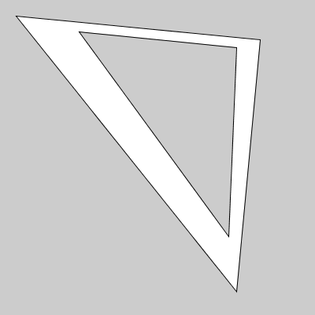

# Desenhando polígonos - II
# Mais sobre polígonos e PShape

agora que já sabemos iterar por uma estrutura de dados, podemos usar as coordenadas das tuplas na lista que vimos anteriormente para desenhar um polígono ou mais genericamente um 'forma' Py5Shape:

```python


def setup():
    size(400, 400)

    pontos = [(50, 50), (300, 370), (200, 50), (150, 150)]

    begin_shape()
    for x, y in pontos:
        vertex(x, y)
    end_shape(CLOSE)


```


# Formas com furos

podemos criar furos dentro de formas `Py5Shape` pendindo uma sequência de vértices, com`vertex()`, entre as funções `begin_contour()` e `end_contour()`, que por sua vez precisam estar entre `begin_shape()` e `end_shape()`.

**note que é preciso que a direção dos pontos da forma interna, do furo, seja contrária a da forma externa.**

no exemplo a seguir vamos descrever com uma lista de tuplas 3 vértices em sentido horário, e os vértices do furo no mesmo sentido. para funcionar corretamente o furo, no segundo laço `for` os pontos do furo tem sua ordem invertida com `pontos_furo[::-1]`. experimente remover essa inversão para ver o resultado!

```python


def setup():
    size(400, 400)
    # fill(200, 100, 100)
    # rect(50, 50, 300, 300) # retângulo rosa pra destacar furo

    pontos_shape = [(20, 20), (330, 50), (300, 370)]
    pontos_furo = [(100, 40), (300, 60), (290, 300)]

    fill(255)
    begin_shape()
    for x, y in pontos_shape:
        vertex(x, y)
    begin_contour()
    for x, y in pontos_furo[::-1]:
        vertex(x, y)
    end_contour()
    end_shape(CLOSE)


```



# Assuntos relacionados

- [desenhando polígonos - I](poligonos_1.md)
- [sequências e laços de repetição](lacos_py.md)


# EXTRA: Funções para desenhar sequências de pontos em forma de polígono

**desafio: ** você conseguiria encapsular em uma função a parte do código que faz o desenho do polígono?

<details >
<summary > resposta: uma função que desenha polígonos a partir de sequências de pontos. < /summary >

```python


def setup():
    size(400, 400)
    pontos_shape = [(20, 20), (330, 50), (300, 370)]
    draw_poly(pontos_shape)


def draw_poly(points, holes=None, closed=True):
    """
    aceita como pontos sequencias de tuplas, lista ou vetores com (x, y) ou (x, y, z).
    por default faz um polígono fechado.
    """
    begin_shape()  # inicia o PShape
    for p in points:
        vertex(p[0], p[1])
    # encerra o PShape
    if closed:
        end_shape(CLOSE)
    else:
        end_shape()


    # Para aceitar pontos em 2D ou 3D
    # for p in points:
    #     if len(p) == 2:
    #         vertex(p[0], p[1])
    #     else:
    #         vertex(*p)  # desempacota pontos em 3d
```

</details >

**avançado: ** agora imagine uma função que desenha um Py5Shape com furos se mandarmos uma lista de pontos, mais uma lista de furos com polígonos dentro.

<details >
<summary > resposta: uma função que desenha polígonos com furos. < /summary >

```python


def setup():
    size(400, 400)

    pontos_shape = [(20, 20), (330, 50), (300, 370)]
    pontos_furo = [(290, 300), (300, 60), (100, 40)]

    poly_and_holes(pontos_shape, [pontos_furo])
    # poly_and_holes(pontos_shape, pontos_furo)  # tabém funciona

    save_frame('contour_furo.png')


def poly_and_holes(points, holes=None, closed=True):
    """
    aceita como pontos sequencias de tuplas, lista ou vetores com (x, y) ou (x, y, z).
    note que `holes` espera uma sequencias de sequencias ou uma única sequencia de
    pontos. por default faz um polígono fechado.
    """

    def depth(seq):
        """
        usada para checar se temos um furo ou vários
        devolve 2 para um só furo, 3 para vários furos
        """
        if (isinstance(seq, list) or
                isinstance(seq, tuple) or
                isinstance(seq, p_vector)):
            return 1 + max(depth(item) for item in seq)
        else:
            return 0

    begin_shape()  # inicia o PShape
    for p in points:
        if len(p) == 2:
            vertex(p[0], p[1])
        else:
            vertex(*p)  # desempacota pontos em 3d
    # tratamento dos furos, se houver
    holes = holes or []  # equivale a: holes if holes else []
    if holes and depth(holes) == 2:  # sequência única de pontos
        holes = (holes,)     # envolve em um tupla
    for hole in holes:  # para cada furo
        begin_contour()  # inicia o furo
        for p in hole:
            if len(p) == 2:
                vertex(p[0], p[1])
            else:
                vertex(*p)
        end_contour()  # final e um furo
    # encerra o PShape
    if closed:
        end_shape(CLOSE)
    else:
        end_shape()


```
</details >
